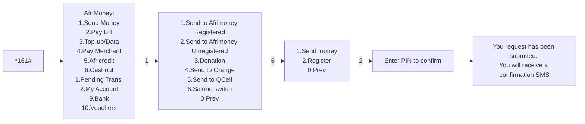
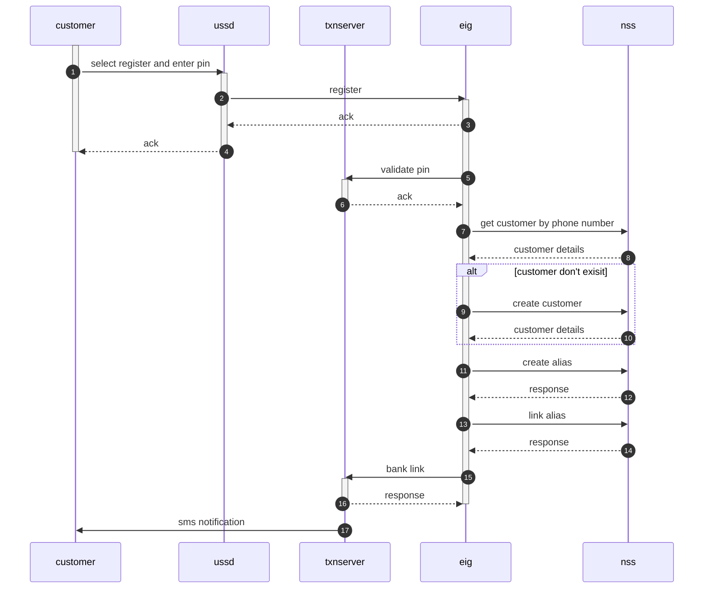

# description
This flow allows an Afirmoney customer to create an alias that any other switch sender can use to send him money. 

The customer won't enter any information manually. All informations required in this process will be retrieved from Afrimoney DB.

# USSD menu




# service flow




# requests

## Get customer by phone number

### Request
```bash
curl -X POST 'http://172.16.10.181:23473/api/fp/customer/accounts' \
--header 'Content-Type: application/json' \
--data '{
  "mobileNumber": "65889902"
}'
```

### Response success

response[0].customer.id, (75 in this example) is the id of the customer

```json
{
    "errorCode": null,
    "errorDescription": null,
    "description": null,
    "response": [
        {
            "id": 54,
            "iban": "TEST00044",
            "accountNumber": "077000000",
            "status": 1,
            "technicalCounter": null,
            "overDraftLimit": null,
            "netPosition": null,
            "minimumDeposit": null,
            "balance": null,
            "type": 0,
            "remainingBalance": null,
            "lowLimit": null,
            "baseLimit": null,
            "highLimit": null,
            "currency": "925",
            "bic": "ACELSLFR",
            "customer": {
                "id": 75,
                "name": "Joe",
                "surname": "Koroma",
                "nickName": "Ash",
                "gender": "MALE",
                "birthDate": "1990-04-15",
                "document": "SL077000000",
                "type": "PERSON",
                "participant": null,
                "mobileNumber": "077000000",
                "documentValidityDate": "2024-02-16",
                "customerForAlias": null
            },
            "default": false
        }
    ]
}
```

### Response fail

```json
```


## create customer

### request

```bash
curl -X POST 'http://172.16.10.181:23471/api/fp/customer' \
--header 'Content-Type: application/json' \
--data '{
"name": "Joe",
"surname": "Koroma",
"nickName": "Ash",
"gender": "MALE",
"birthDate": "1990-04-15",
"document": "SL077928000",
"type": "PERSON",
"mobileNumber": "077928000",
"documentValidityDate": "2024-01-16"
}'
```

### response success

```json
{
    "errorCode": null,
    "errorDescription": null,
    "description": "Customer has been created!",
    "response": {
        "id": 76,
        "name": "Joe",
        "surname": "Koroma",
        "nickName": "Ash",
        "gender": "MALE",
        "birthDate": "1990-04-15",
        "document": "SL077000001",
        "type": "PERSON",
        "participant": null,
        "mobileNumber": "077000000",
        "documentValidityDate": "2024-02-16",
        "customerForAlias": null
    }
}
```

### reponse fail

```json
```

## create alias

### request

76 in the url is the customer ID retrieved from previous APIs

```bash
curl -X POST 'http://172.16.10.181:23473/api/fp/customer/76/aliases/' \
--header 'Content-Type: application/json' \
--data '[
    {
        "type": "MOBILE",
        "value": "077000000",
        "status": 1,
        "startDate": "2024-01-04",
        "expireDate": "2026-12-11"
    }
]'
```

### response success

```json
{
    "errorCode": null,
    "errorDescription": null,
    "description": null,
    "response": [
        {
            "id": 73,
            "type": "MOBILE",
            "value": "077000000",
            "status": 1,
            "expireDate": "2026-12-11",
            "startDate": "2024-01-04"
        }
    ]
}
```
### reponse fail
```json
```

## link alias

### request

```bash
curl -X POST 'http://172.16.10.181:23473/api/fp/accounts/linked/alias' \
--header 'Content-Type: application/json' \
--header 'Cookie: csrftoken=qSBp5B4Cq8sePao7RNLN900SDkGzXNCy' \
--data '[{
"aliasValue":"077000000", 
"bic":"ACELSLFR",
"iban":"077000000",
"accountNumber":"077000000",
"type":0,
"status":1,
"isDefault":false,
"currency":"925"
}]'
```

### response success

```json
{
    "errorCode": null,
    "errorDescription": null,
    "description": null,
    "response": [
        {
            "id": 54,
            "aliasValue": "077000000",
            "bic": "ACELSLFR",
            "iban": "TEST00044",
            "accountNumber": "077000000",
            "type": 0,
            "status": 1,
            "isDefault": false,
            "currency": "925"
        }
    ]
}
```

### reponse fail
```json
```


[Main](README.MD)