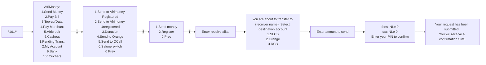
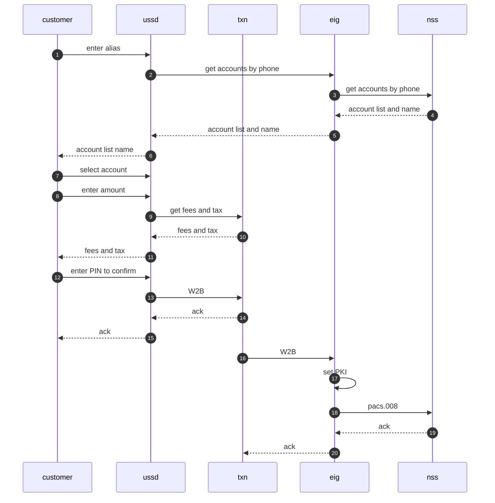

# USSD menu





# flow



# APIs

## pay

### request pacs.008.001.10
```xml
<fpenvelope
	xmlns="urn:iso:std:iso:20022:tech:xsd:payment_request"
	xmlns:document="urn:iso:std:iso:20022:tech:xsd:pacs.008.001.10"
	xmlns:header="urn:iso:std:iso:20022:tech:xsd:head.001.001.03">
	<header:apphdr>
		<header:fr>
			<header:fiid>
				<header:fininstnid>
					<header:othr>
						<header:id>ACELSLFR</header:id>
					</header:othr>
				</header:fininstnid>
			</header:fiid>
		</header:fr>
		<header:to>
			<header:fiid>
				<header:fininstnid>
					<header:othr>
						<header:id>GTBISLFR</header:id>
					</header:othr>
				</header:fininstnid>
			</header:fiid>
		</header:to>
		<header:bizmsgidr>ST231121.1329.B005</header:bizmsgidr>
		<header:msgdefidr>pacs.008.001.10</header:msgdefidr>
		<header:credt>2023-11-21T13:27:10.792+00:00</header:credt>
	</header:apphdr>
	<document:document>
		<document:fitoficstmrcdttrf>
			<document:grphdr>
				<document:msgid>ST231121.1329.B005</document:msgid>
				<document:credttm>2023-11- 21T13:27:10.792+00:00</document:credttm>
				<document:nboftxs>1</document:nboftxs>
				<document:sttlminf>
					<document:sttlmmtd>CLRG</document:sttlmmtd>
					<document:clrsys>
						<document:prtry>ACELSLFR</document:prtry>
					</document:clrsys>
				</document:sttlminf>
				<document:pmttpinf>
					<document:lclinstrm>
						<document:prtry>P2P</document:prtry>
					</document:lclinstrm>
				</document:pmttpinf>
				<document:instgagt>
					<document:fininstnid>
						<document:othr>
							<document:id>ACELSLFR</document:id>
						</document:othr>
					</document:fininstnid>
				</document:instgagt>
				<document:instdagt>
					<document:fininstnid>
						<document:othr>
							<document:id>GTBISLFR</document:id>
						</document:othr>
					</document:fininstnid>
				</document:instdagt>
			</document:grphdr>
			<document:cdttrftxinf>
				<document:pmtid>
					<document:endtoendid>ST231121.1329.B005</document:endtoendid>
					<document:txid>ST231121.1329.B005</document:txid>
				</document:pmtid>
				<document:intrbksttlmamt ccy="SLE">10</document:intrbksttlmamt>
				<document:accptncdttm>2023-11- 21T13:27:10.792+00:00</document:accptncdttm>
				<document:instdamt ccy="SLE">10</document:instdamt>
				<document:chrgbr>SLEV</document:chrgbr>
				<document:dbtr>
					<document:nm>Test Test</document:nm>
					<document:pstladr>
						<document:adrline>Freetown</document:adrline>
					</document:pstladr>
				</document:dbtr>
				<document:dbtracct>
					<document:id>
						<document:othr>
							<document:id>123123212313</document:id>
							<document:schmenm>
								<document:prtry>ACCT</document:prtry>
							</document:schmenm>
						</document:othr>
					</document:id>
				</document:dbtracct>
				<document:dbtragt>
					<document:fininstnid>
						<document:othr>
							<document:id>ACELSLFR</document:id>
						</document:othr>
					</document:fininstnid>
				</document:dbtragt>
				<document:cdtragt>
					<document:fininstnid>
						<document:othr>
							<document:id>GTBISLFR</document:id>
						</document:othr>
					</document:fininstnid>
				</document:cdtragt>
				<document:cdtr>
					<document:nm>MV</document:nm>
				</document:cdtr>
				<document:cdtracct>
					<document:id>
						<document:othr>
							<document:id>1234567890</document:id>
							<document:schmenm>
								<document:prtry>ACCT</document:prtry>
							</document:schmenm>
						</document:othr>
					</document:id>
				</document:cdtracct>
				<document:rmtinf>
					<document:ustrd>Testing...</document:ustrd>
				</document:rmtinf>
			</document:cdttrftxinf>
		</document:fitoficstmrcdttrf>
	</document:document>
</fpenvelope>
```

### response success
```xml
```

### reponse fail
```xml
```


[Main](README.MD)