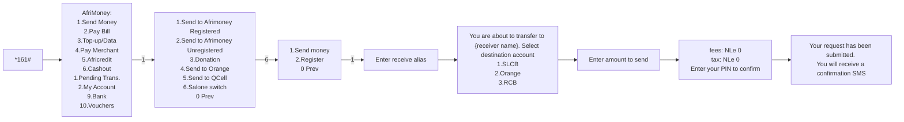
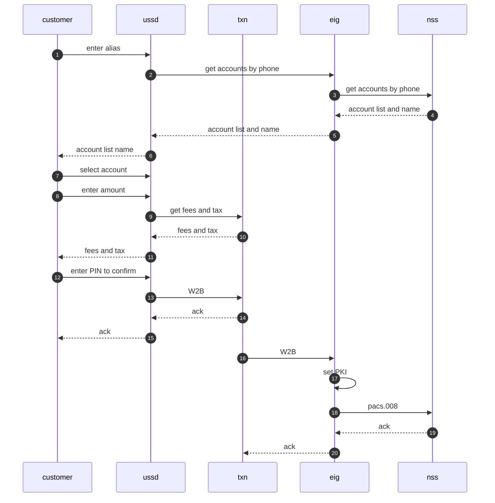

# USSD menu





# flow



# APIs

## pay

### request pacs.008.001.10
```xml
<FPEnvelope
	xmlns="urn:iso:std:iso:20022:tech:xsd:payment_request"
	xmlns:document="urn:iso:std:iso:20022:tech:xsd:pacs.008.001.10"
	xmlns:header="urn:iso:std:iso:20022:tech:xsd:head.001.001.03">
	<header:AppHdr>
		<header:Fr>
			<header:FIId>
				<header:FinInstnId>
					<header:Othr>
						<header:Id>SLCBSLFR</header:Id>
					</header:Othr>
				</header:FinInstnId>
			</header:FIId>
		</header:Fr>
		<header:To>
			<header:FIId>
				<header:FinInstnId>
					<header:Othr>
						<header:Id>FP</header:Id>
					</header:Othr>
				</header:FinInstnId>
			</header:FIId>
		</header:To>
		<header:BizMsgIdr>MSG-ID2024020803205408300000</header:BizMsgIdr>
		<header:MsgDefIdr>pacs.008.001.10</header:MsgDefIdr>
		<header:CreDt>2024-02-08T00:00:00.000Z</header:CreDt>
		<document:Sgntr
			xmlns:document="urn:iso:std:iso:20022:tech:xsd:head.001.001.03">
			<ds:Signature
				xmlns:ds="http://www.w3.org/2000/09/xmldsig#">
				<ds:SignedInfo>
					<ds:CanonicalizationMethod Algorithm="http://www.w3.org/2001/10/xml-exc-c14n#"/>
					<ds:SignatureMethod Algorithm="http://www.w3.org/2000/09/xmldsig#rsa-sha1"/>
					<ds:Reference URI="#_eac570e9-62e2-44dd-a648-b8b794d5a28f">
						<ds:Transforms>
							<ds:Transform Algorithm="http://www.w3.org/2001/10/xml-exc-c14n#"/>
						</ds:Transforms>
						<ds:DigestMethod Algorithm="http://www.w3.org/2001/04/xmlenc#sha256"/>
						<ds:DigestValue>lhar4R+ae7MlGjzZgmlDahuqjgN8gMQ0HEJ8MXprL6Y=</ds:DigestValue>
					</ds:Reference>
					<ds:Reference Type="http://uri.etsi.org/01903/v1.3.2#SignedProperties" URI="#_6d28216b-9306-401d-8438-f5c8551b3fb5-signedprops">
						<ds:Transforms>
							<ds:Transform Algorithm="http://www.w3.org/2001/10/xml-exc-c14n#"/>
						</ds:Transforms>
						<ds:DigestMethod Algorithm="http://www.w3.org/2001/04/xmlenc#sha256"/>
						<ds:DigestValue>KjUrSiiTyfdvW1g9EmGgxDr51ax46o1SSiiq2NXH2xI=</ds:DigestValue>
					</ds:Reference>
					<ds:Reference>
						<ds:Transforms>
							<ds:Transform Algorithm="http://www.w3.org/2001/10/xml-exc-c14n#"/>
						</ds:Transforms>
						<ds:DigestMethod Algorithm="http://www.w3.org/2001/04/xmlenc#sha256"/>
						<ds:DigestValue>M4NxBK6pcFib+GdduyLIA7Jqitn4sOZSyX1IKQRT+tY=</ds:DigestValue>
					</ds:Reference>
				</ds:SignedInfo>
				<ds:SignatureValue>UVzcK+WjMK5zPOwhSEU/PKAp4F7TbnL8yjZInte4VwIVop1tb+CBcKCw9UDYNf5XThtJ4il3Kpa10xRAiPrrHMzxaZFMs1tZsoZhq43A0GnE+0bSDLJSUPewPtsoWhDnCCwSKxJEeuZK341YhOQVPMpzrnTw2tNbfbPszZj4tnGeb81TSjsLPt7pQRlGuxIjBTiO0DmqMbGmwB9UmKQOA2jkEhNlKE9wCORna7CAkztdHCl+msaoqcwKQewHaLSjT+WV7U2MR6MyRwYUsYL3kGw56DUULSkFlIQ/9skV/0cuUvRSuPQ6OJqSUeMhVOMZTaGENKKJETwtThcKyj7ZAg==</ds:SignatureValue>
				<ds:KeyInfo Id="_eac570e9-62e2-44dd-a648-b8b794d5a28f">
					<ds:X509Data>
						<ds:X509IssuerSerial>
							<ds:X509IssuerName>CN=BSL-ISSUER-CA01, DC=saps, DC=gov, DC=sl</ds:X509IssuerName>
							<ds:X509SerialNumber>2274676010371594674665261008416944010192486423</ds:X509SerialNumber>
						</ds:X509IssuerSerial>
					</ds:X509Data>
				</ds:KeyInfo>
				<ds:Object>
					<xades:QualifyingProperties
						xmlns:xades="http://uri.etsi.org/01903/v1.3.2#">
						<xades:SignedProperties Id="_6d28216b-9306-401d-8438-f5c8551b3fb5-signedprops">
							<xades:SignedSignatureProperties>
								<xades:SigningTime>2024-02-08T14:16:53Z</xades:SigningTime>
							</xades:SignedSignatureProperties>
						</xades:SignedProperties>
					</xades:QualifyingProperties>
				</ds:Object>
			</ds:Signature>
		</document:Sgntr>
	</header:AppHdr>
	<document:Document>
		<document:FIToFICstmrCdtTrf>
			<document:GrpHdr>
				<document:MsgId>MSG-ID2024020803205408300000</document:MsgId>
				<document:CreDtTm>2024-02-08T00:00:00.000+00:00</document:CreDtTm>
				<document:NbOfTxs>1</document:NbOfTxs>
				<document:SttlmInf>
					<document:SttlmMtd>CLRG</document:SttlmMtd>
					<document:ClrSys>
						<document:Prtry>FP</document:Prtry>
					</document:ClrSys>
				</document:SttlmInf>
				<document:PmtTpInf>
					<document:LclInstrm>
						<document:Prtry>P2P</document:Prtry>
					</document:LclInstrm>
				</document:PmtTpInf>
				<document:InstgAgt>
					<document:FinInstnId>
						<document:Othr>
							<document:Id>SLCBSLFR</document:Id>
						</document:Othr>
					</document:FinInstnId>
				</document:InstgAgt>
				<document:InstdAgt>
					<document:FinInstnId>
						<document:Othr>
							<document:Id>RCBKSLFR</document:Id>
						</document:Othr>
					</document:FinInstnId>
				</document:InstdAgt>
			</document:GrpHdr>
			<document:CdtTrfTxInf>
				<document:PmtId>
					<document:EndToEndId>-</document:EndToEndId>
					<document:TxId>SLCBSLFR5041898316306</document:TxId>
				</document:PmtId>
				<document:IntrBkSttlmAmt Ccy="SLE">10</document:IntrBkSttlmAmt>
				<document:AccptncDtTm>2024-02-08T17:42:39.071+00:00</document:AccptncDtTm>
				<document:InstdAmt Ccy="SLE">10</document:InstdAmt>
				<document:ChrgBr>SLEV</document:ChrgBr>
				<document:Dbtr>
					<document:Nm>MSCWT</document:Nm>
					<document:PstlAdr>
						<document:AdrLine>MOSCOW</document:AdrLine>
					</document:PstlAdr>
				</document:Dbtr>
				<document:DbtrAcct>
					<document:Id>
						<document:Othr>
							<document:Id>131234567890</document:Id>
							<document:SchmeNm>
								<document:Prtry>ACCT</document:Prtry>
							</document:SchmeNm>
							<document:Issr>C</document:Issr>
						</document:Othr>
					</document:Id>
				</document:DbtrAcct>
				<document:DbtrAgt>
					<document:FinInstnId>
						<document:Othr>
							<document:Id>SLCBSLFR</document:Id>
							<document:Issr>ATM</document:Issr>
						</document:Othr>
					</document:FinInstnId>
				</document:DbtrAgt>
				<document:CdtrAgt>
					<document:FinInstnId>
						<document:Othr>
							<document:Id>RCBKSLFR</document:Id>
						</document:Othr>
					</document:FinInstnId>
				</document:CdtrAgt>
				<document:Cdtr>
					<document:Nm>test</document:Nm>
				</document:Cdtr>
				<document:CdtrAcct>
					<document:Id>
						<document:Othr>
							<document:Id>0201303135001</document:Id>
							<document:SchmeNm>
								<document:Prtry>ACCT</document:Prtry>
							</document:SchmeNm>
						</document:Othr>
					</document:Id>
				</document:CdtrAcct>
				<document:RmtInf>
					<document:Ustrd>SLCB Transfer funds to RCB</document:Ustrd>
				</document:RmtInf>
			</document:CdtTrfTxInf>
		</document:FIToFICstmrCdtTrf>
	</document:Document>
</FPEnvelope>

```

### response success
```xml
```

### reponse fail
```xml
```


[Main](README.MD)