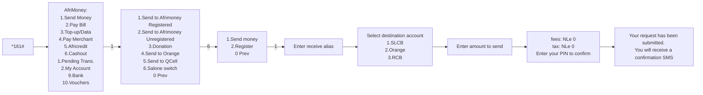
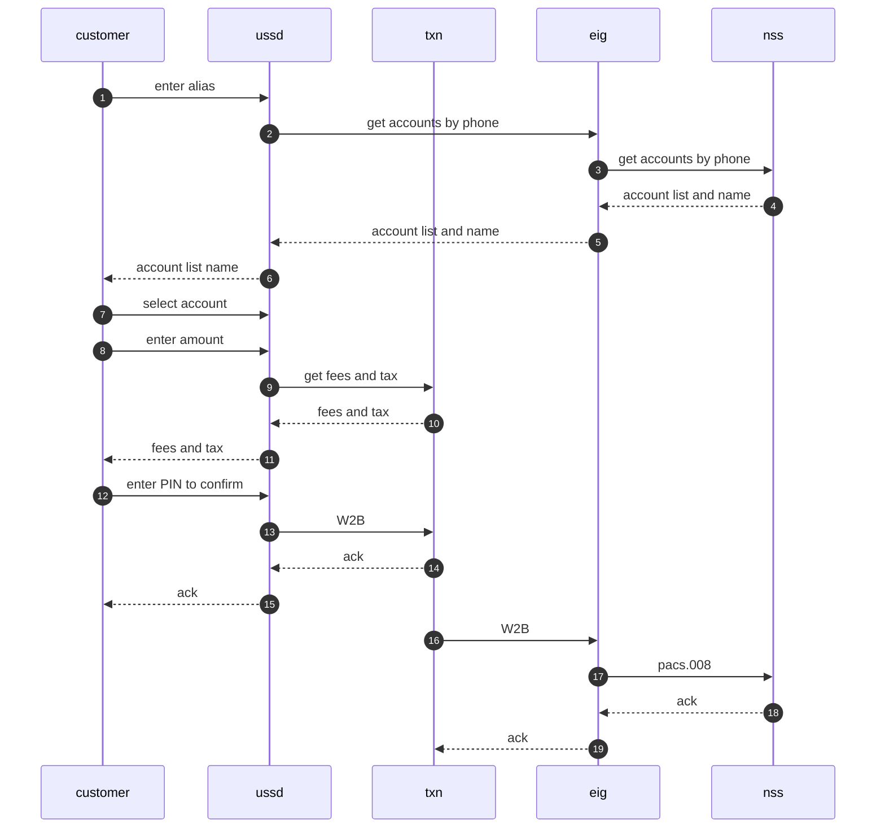

# USSD menu

```mermaid
flowchart LR


step0[
    *161#
]

 step1[AfriMoney:
1.Send Money
2.Pay Bill
3.Top-up/Data
4.Pay Merchant
5.Africredit
6.Cashout
1.Pending Trans.
2.My Account
9.Bank
10.Vouchers
]

step2[
1.Send to Afrimoney Registered
2.Send to Afrimoney Unregistered
3.Donation
4.Send to Orange
5.Send to QCell
6.Salone switch
0 Prev
]

step2b[
1.Send money
2.Register
0 Prev
]

step3[Enter receive alias]

step4[Select destination account
1.SLCB
2.Orange
3.RCB
]

step5[Enter amount to send]

step6[
    fees: NLe 0
    tax: NLe 0
    Enter your PIN to confirm
]

step7[Your request has been submitted. 
You will receive a confirmation SMS]

step0 -->step1-->|1|step2-->|6|step2b-->|1|step3-->step4-->step5-->step6-->step7

```

# flow

```mermaid
sequenceDiagram
    autonumber
    participant customer
    participant ussd
    participant txn
    participant eig
    participant nss

    customer ->> ussd: enter alias
    ussd ->> eig: get accounts by phone
    eig ->> nss: get accounts by phone
    nss -->> eig: account list and name
    eig -->> ussd: account list and name
    ussd -->> customer: account list name
    customer ->> ussd: select account
    customer ->> ussd: enter amount
    ussd ->> txn: get fees and tax
    txn -->> ussd: fees and tax
    ussd -->> customer: fees and tax
    customer ->> ussd: enter PIN to confirm
    ussd ->> txn: W2B
    txn -->> ussd:ack
    ussd -->> customer: ack
    txn ->> eig: W2B
    eig ->> nss: pacs.008
    nss -->> eig: ack
    eig -->>txn: ack
```

[Main](README.MD)