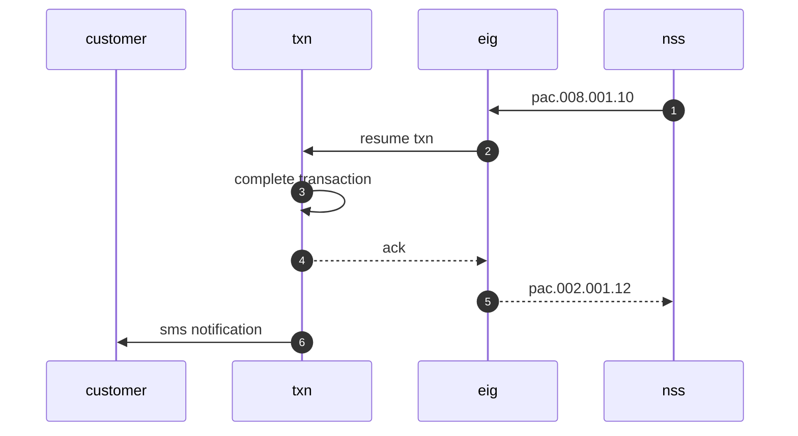

# flow



# APIs

## status pacs.002.001.12

### request

```xml
<fpenvelope
	xmlns="urn:iso:std:iso:20022:tech:xsd:payment_response"
	xmlns:document="urn:iso:std:iso:20022:tech:xsd:pacs.002.001.12"
	xmlns:header="urn:iso:std:iso:20022:tech:xsd:head.001.001.03">
	<header:apphdr>
		<header:fr>
			<header:fiid>
				<header:fininstnid>
					<header:othr>
						<header:id>GTBISLFR</header:id>
					</header:othr>
				</header:fininstnid>
			</header:fiid>
		</header:fr>
		<header:to>
			<header:fiid>
				<header:fininstnid>
					<header:othr>
						<header:id>FP</header:id>
					</header:othr>
				</header:fininstnid>
			</header:fiid>
		</header:to>
		<header:bizmsgidr>GTBISLFR2023112113270500890</header:bizmsgidr>
		<header:msgdefidr>pacs.002.001.12</header:msgdefidr>
		<header:credt>2023-11-21T01:27:05.891Z</header:credt>
		<header:rltd>
			<header:fr>
				<header:fiid>
					<header:fininstnid>
						<header:othr>
							<header:id>FP</header:id>
						</header:othr>
					</header:fininstnid>
				</header:fiid>
			</header:fr>
			<header:to>
				<header:fiid>
					<header:fininstnid>
						<header:othr>
							<header:id>GTBISLFR</header:id>
						</header:othr>
					</header:fininstnid>
				</header:fiid>
			</header:to>
			<header:bizmsgidr>ACELSLFR332513287868889205906</header:bizmsgidr>
			<header:msgdefidr>pacs.008.001.10</header:msgdefidr>
			<header:credt>2023-11-21T13:27:05.005Z</header:credt>
		</header:rltd>
	</header:apphdr>
	<document:document>
		<document:fitofipmtstsrpt>
			<document:grphdr>
				<document:msgid>GTBISLFR2023112113270500890</document:msgid>
				<document:credttm>2023-11-21T13:27:05.891Z</document:credttm>
				<document:instgagt>
					<document:fininstnid>
						<document:othr>
							<document:id>GTBISLFR</document:id>
						</document:othr>
					</document:fininstnid>
				</document:instgagt>
				<document:instdagt>
					<document:fininstnid>
						<document:othr>
							<document:id>ACELSLFR</document:id>
						</document:othr>
					</document:fininstnid>
				</document:instdagt>
			</document:grphdr>
			<document:orgnlgrpinfandsts>
				<document:orgnlmsgid>ACELSLFR332513287868889205906</document:orgnlmsgid>
				<document:orgnlmsgnmid>pacs.008.001.10</document:orgnlmsgnmid>
				<document:orgnlcredttm>2023-11-21T13:27:05.686Z</document:orgnlcredttm>
			</document:orgnlgrpinfandsts>
			<document:txinfandsts>
				<document:orgnlendtoendid>-</document:orgnlendtoendid>
				<document:orgnltxid>ST231121.1329.B005</document:orgnltxid>
				<document:txsts>ACSC</document:txsts>
				<document:accptncdttm>2023-11- 21T13:27:10.792+00:00</document:accptncdttm>
				<document:orgnltxref>
					<document:intrbksttlmamt ccy="SLE">10</document:intrbksttlmamt>
					<document:amt>
						<document:instdamt ccy="SLE">10</document:instdamt>
					</document:amt>
					<document:dbtr>
						<document:pty>
							<document:nm>MV</document:nm>
							<document:pstladr>
								<document:adrline>Freetown</document:adrline>
							</document:pstladr>
						</document:pty>
					</document:dbtr>
					<document:dbtracct>
						<document:id>
							<document:othr>
								<document:id>123123212313</document:id>
								<document:schmenm>
									<document:prtry>ACCT</document:prtry>
								</document:schmenm>
							</document:othr>
						</document:id>
					</document:dbtracct>
					<document:cdtracct>
						<document:id>
							<document:othr>
								<document:id>1234567890</document:id>
								<document:schmenm>
									<document:prtry>ACCT</document:prtry>
								</document:schmenm>
							</document:othr>
						</document:id>
					</document:cdtracct>
				</document:orgnltxref>
			</document:txinfandsts>
		</document:fitofipmtstsrpt>
	</document:document>
</fpenvelope>
```

### response success
```xml
```

### reponse fail
```xml
```


[Main](README.MD)
